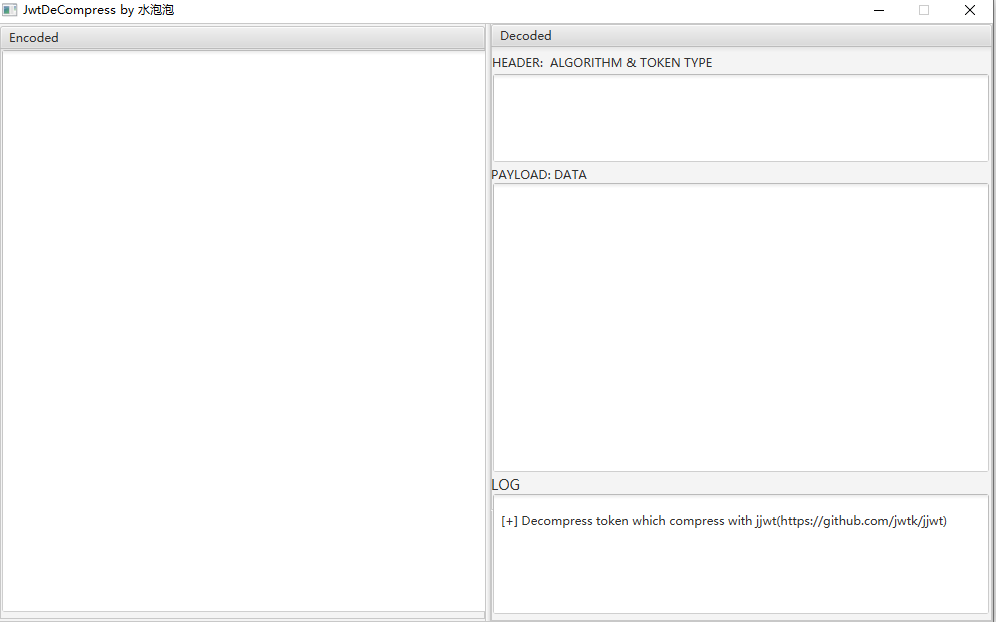
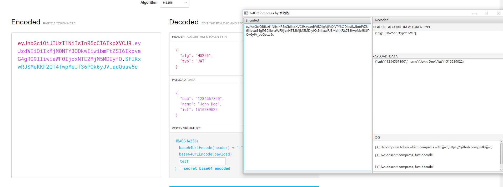
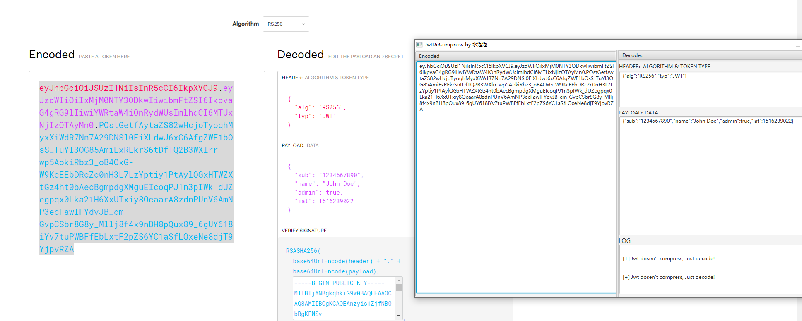
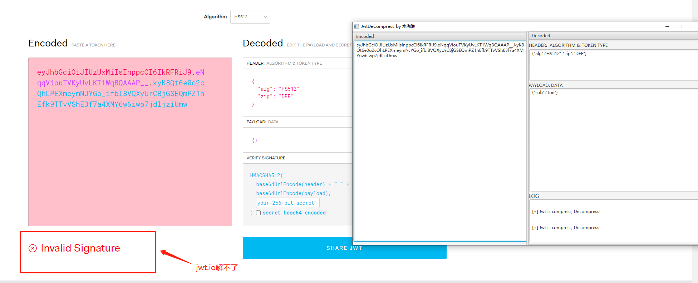
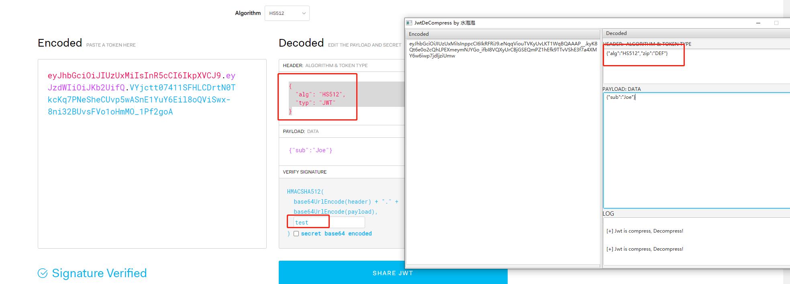

## JwtDeCompress

### 运行环境：

jdk8+

### 工具简介:

使用`javafx`编写的一个解码`jwt`的图形化工具

工具只有`decode`功能，没有`encode`功能

此工具的主要目的是为了解决`jwt.io`没法解码由[jjwt](https://github.com/jwtk/jjwt)进行压缩的`jwt token`

理论上此工具能解码所有的`jwt token`

#### 1，普通jwt 

HS512

RS256

#### 2，压缩的jwt

案例来源于`killer`师傅

### 实际测试

在渗透测试中，往往需要测试`jwt body`中的数据，需要重新`encode`，如果后端是用了`jjwt`的话其实是会自动判断有没有压缩的，没有压缩也会`decode`成功，所以我们把内容抠出来放到`jwt.io`重新`encode`即可，当然要知道`secret key`。

步骤如下：

将工具解出来`Payload`数据丢`jwt.io`的`Payload`处，至于`header`需要将`{"alg":"HS512","zip":"DEF"}` 中的`zip`部分替换为`"typ":"JWT"`，也就是`{"alg":"HS256","typ":"JWT"}`，之后填入`key`进行`encode`

最后将得到的`jwt token`发到服务端进行测试即可。

**注意**：目标为什么用`jjwt`压缩`body`，就是因为不压缩太大了不好传输，如`tomcat`的`header`限制为8024个字节，我们不压缩情况下重新发送的话，可能会超字节，对于这个问题需要用`jjwt`撸代码解决，后续可能会更新工具的`encode`功能解决

